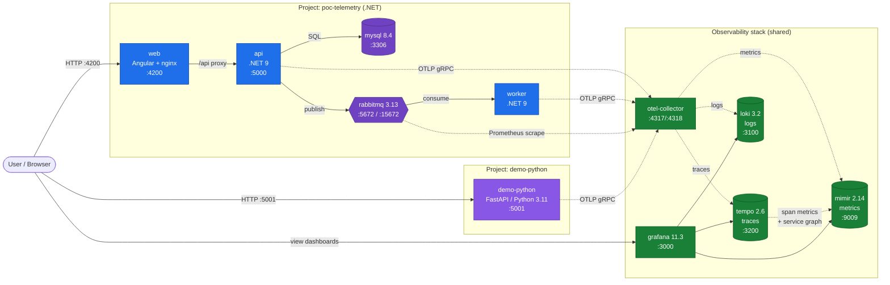

# Architecture

## Flux

- **Applicatif** (traits pleins):
  - Project `poc-telemetry`: `User → web (Angular) → api (.NET) → MySQL`, et `api → RabbitMQ → worker`.
  - Project `demo-python`: `User → demo-python (FastAPI)` directement.
- **Télémétrie** (traits pointillés): tous les services (.NET + Python) exportent en OTLP/gRPC vers le **même** otel-collector, qui répartit traces → Tempo, logs → Loki, metrics → Mimir. Tempo génère en plus des span-metrics et le service-graph qu'il pousse vers Mimir.
- **Grafana** lit les trois datasources et expose les dashboards avec un filtre `$project` pour basculer entre les projets ou les comparer.

## Projets

| Projet           | Stack                  | Ports exposés         | Attribut OTel              |
|------------------|------------------------|-----------------------|----------------------------|
| `poc-telemetry`  | .NET 9 + Angular       | 4200 (UI), 5000 (API) | `project=poc-telemetry`    |
| `demo-python`    | Python 3.11 / FastAPI  | 5001                  | `project=demo-python`      |

## Réseaux Docker

- `default` (par app stack).
- `observability` (externe, partagé): otel-collector, tempo, loki, mimir, grafana. Les services applicatifs sont attachés à `observability` pour atteindre le collector.

## Ports exposés (host)

| Service       | Port  | Usage                  |
|---------------|-------|------------------------|
| web           | 4200  | UI Angular             |
| api           | 5000  | API REST .NET          |
| demo-python   | 5001  | API REST FastAPI       |
| mysql         | 3306  | DB                     |
| rabbitmq      | 5672  | AMQP                   |
| rabbitmq      | 15672 | Management UI          |
| otel          | 4317  | OTLP gRPC              |
| otel          | 4318  | OTLP HTTP              |
| tempo         | 3200  | Tempo HTTP API         |
| loki          | 3100  | Loki HTTP API          |
| mimir         | 9009  | Mimir / Prometheus API |
| grafana       | 3000  | Grafana UI             |
