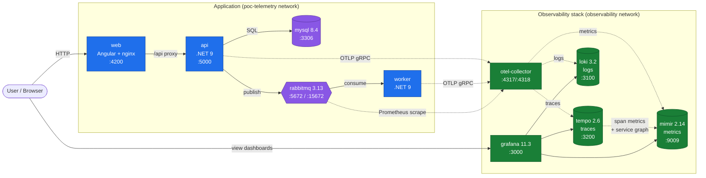

# Architecture

## Flux

- **Applicatif** (traits pleins): `User → web (Angular) → api (.NET) → MySQL`, et `api → RabbitMQ → worker`.
- **Télémétrie** (traits pointillés): `api` et `worker` exportent en OTLP/gRPC vers `otel-collector`, qui répartit traces → Tempo, logs → Loki, metrics → Mimir. Tempo génère en plus des span-metrics et le service-graph qu'il pousse vers Mimir.
- **Grafana** lit les trois datasources pour ses dashboards.

## Réseaux Docker

- `default` (applicatif): web, api, worker, mysql, rabbitmq.
- `observability` (externe, partagé): otel-collector, tempo, loki, mimir, grafana. RabbitMQ et l'API sont aussi attachés à ce réseau pour atteindre le collector et exposer les métriques.

## Ports exposés (host)

| Service     | Port  | Usage                  |
|-------------|-------|------------------------|
| web         | 4200  | UI Angular             |
| api         | 5000  | API REST               |
| mysql       | 3306  | DB                     |
| rabbitmq    | 5672  | AMQP                   |
| rabbitmq    | 15672 | Management UI          |
| otel        | 4317  | OTLP gRPC              |
| otel        | 4318  | OTLP HTTP              |
| tempo       | 3200  | Tempo HTTP API         |
| loki        | 3100  | Loki HTTP API          |
| mimir       | 9009  | Mimir / Prometheus API |
| grafana     | 3000  | Grafana UI             |
