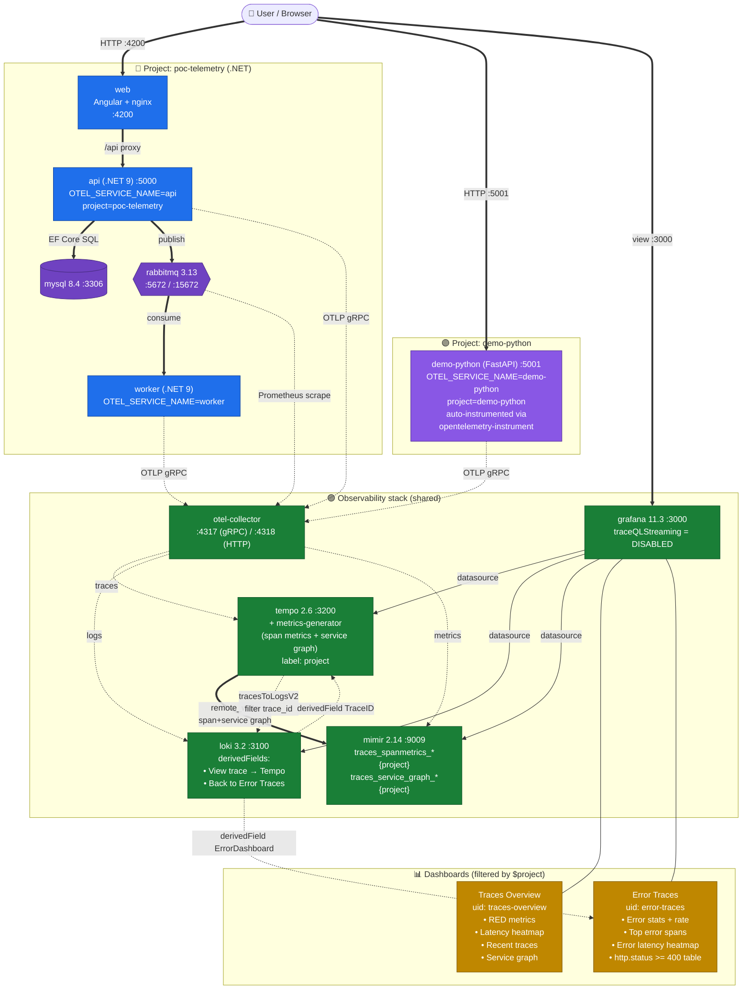

# Setup overview

Vue d'ensemble: deux projets applicatifs (.NET et Python) partagent une seule stack d'observabilité avec dashboards filtrables par projet.

## Légende des flux

| Style          | Signification                                      |
|----------------|----------------------------------------------------|
| ══════►        | Trafic applicatif (HTTP, SQL, AMQP)                |
| ─ ─ ─►         | Export de télémétrie (OTLP, scrape, remote_write)  |
| ─ ─ · ─►       | Corrélations cross-signaux (clic / lien)           |

## Projets actifs

| Projet           | Stack             | Port | Service name(s)        | Attribut OTel              |
|------------------|-------------------|------|------------------------|----------------------------|
| `poc-telemetry`  | .NET 9 + Angular  | 4200 (UI) / 5000 (API) | `api`, `worker`     | `project=poc-telemetry`    |
| `demo-python`    | Python 3.11 / FastAPI | 5001 | `demo-python`     | `project=demo-python`      |

Les deux projets envoient leur télémétrie au **même otel-collector**, donc une seule chaîne Tempo/Loki/Mimir/Grafana sert les deux. Le filtre `$project` dans les dashboards permet de basculer ou de comparer.

## Comment afficher un projet dans les dashboards

1. Ouvrir un dashboard (`/d/traces-overview` ou `/d/error-traces`).
2. Sélecteur **Project** en haut → cocher un projet, plusieurs, ou `All`.
3. Le label `project` est dynamique: un projet n'apparaît que s'il a des spans dans les ~5 dernières minutes (sinon stale).

## Récap des modifs faites

### Fichiers créés
- `src-py/main.py`, `src-py/requirements.txt`, `src-py/Dockerfile` — service FastAPI.
- `observability/grafana/provisioning/dashboards/json/error-traces.json` — dashboard erreurs.
- `docs/architecture.md`, `docs/setup-overview.md` — diagrammes.

### Fichiers modifiés
- `docker-compose.yml` — ajout du service `demo-python`.
- `observability/docker-compose.yml` — `GF_FEATURE_TOGGLES_DISABLE: traceQLStreaming`.
- `observability/grafana/provisioning/datasources/datasources.yaml` — derivedField "Back to Error Traces".
- `observability/grafana/provisioning/dashboards/json/traces-overview.json` — heatmap, fix table TraceQL et service graph.

## Limites connues

- **Angular non instrumenté** → apparaît comme `user` dans le service graph (pas un vrai service).
- **MySQL invisible** dans le service graph (manque `peer_attributes` dans `tempo.yaml`).
- **Staleness** des `traces_spanmetrics_*`: un projet sans trafic récent (>5 min) disparaît du sélecteur jusqu'à génération de nouveau trafic.
