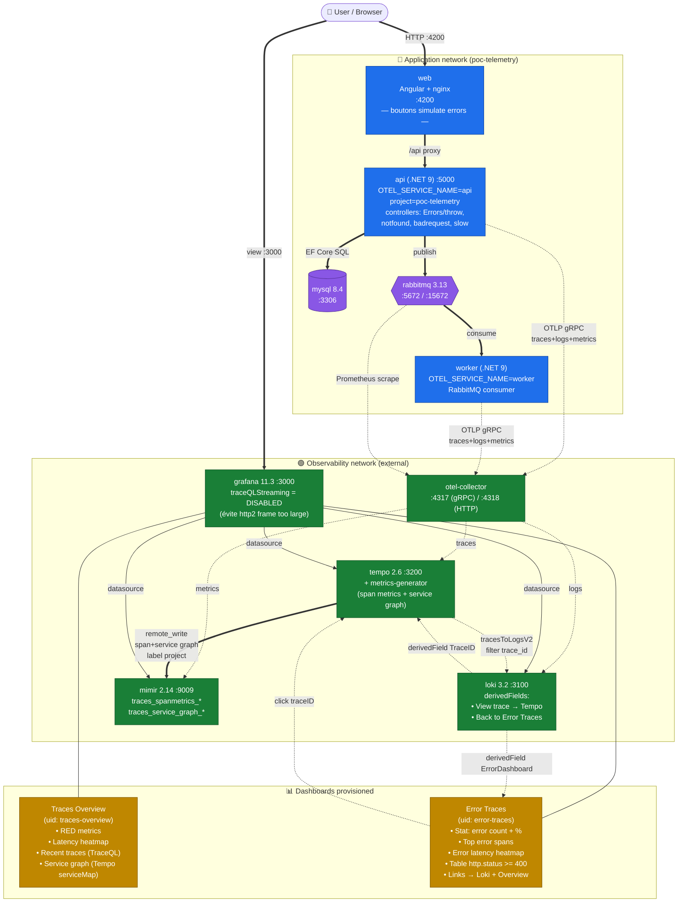

# Setup overview

Vue d'ensemble de tout ce qui a été mis en place: application, pipeline de télémétrie, génération de métriques, dashboards et corrélations cross-signaux.

## Légende des flux

| Style          | Signification                                      |
|----------------|----------------------------------------------------|
| ══════►        | Trafic applicatif (HTTP, SQL, AMQP)                |
| ─ ─ ─►         | Export de télémétrie (OTLP, scrape, remote_write)  |
| ─ ─ · ─►       | Corrélations cross-signaux (clic / lien)           |

## Récap des modifs faites dans cette session

### Fichiers modifiés
- `observability/docker-compose.yml` → désactivation du feature toggle `traceQLStreaming` sur Grafana.
- `observability/grafana/provisioning/datasources/datasources.yaml` → second `derivedField` Loki vers le dashboard Error Traces.
- `observability/grafana/provisioning/dashboards/json/traces-overview.json` → heatmap latence, tolérance noms de métriques, service graph via Tempo, fix table TraceQL.

### Fichiers créés
- `observability/grafana/provisioning/dashboards/json/error-traces.json` → dashboard dédié erreurs (uid `error-traces`).
- `docs/architecture.md` → diagramme architecture.
- `docs/setup-overview.md` → ce document.

## Problèmes résolus en cours de route

1. **`http2: frame too large`** sur la table de traces → causé par le streaming gRPC TraceQL activé par défaut en Grafana 11.x alors que le datasource pointe sur le port HTTP de Tempo. Fix: `GF_FEATURE_TOGGLES_DISABLE: traceQLStreaming`.
2. **Service graph vide** → le panneau nodeGraph attend un format spécifique (nodes + edges). Une requête Prometheus brute ne le produit pas. Fix: utiliser le datasource Tempo avec `queryType: serviceMap`.
3. **Codes HTTP 201 dans la table d'erreurs** → causé par le filtre `status = error` (statut OTel du span) qui inclut des cas où une exception survient *après* la réponse. Fix: filtrer sur `span.http.response.status_code >= 400`.
4. **Noms d'attributs OTel** → l'instrumentation .NET utilise les conventions récentes: `http.request.method` (pas `http.method`), `http.response.status_code` (pas `http.status_code`), `error.type` au lieu d'`exception.*`.

## Limites connues / améliorations possibles

- **Angular non instrumenté** → apparaît comme nœud `user` (virtual) dans le service graph. Pour le vrai bout-en-bout, instrumenter avec `@opentelemetry/sdk-trace-web` + propagation `traceparent`.
- **MySQL invisible** dans le service graph → ajouter `peer_attributes: [db.name, db.system, server.address]` dans `tempo.yaml` pour générer des virtual nodes DB.
- **Métriques `traces_spanmetrics_*` staleness** → après un restart, le metrics-generator n'a rien à pousser tant qu'aucune trace n'est arrivée. Générer du trafic pour réamorcer.
